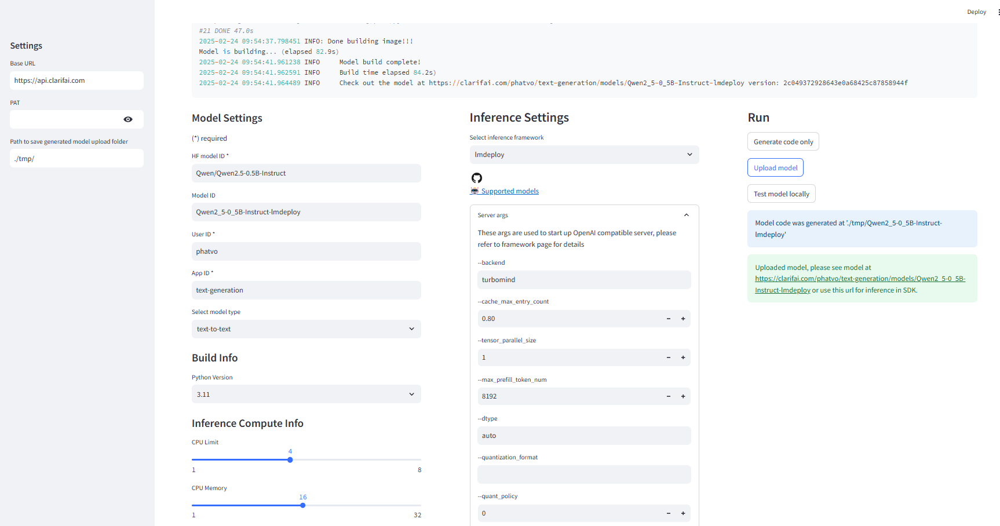

# One click deploy
one deploy llm/vlm in Clarifai




# Install

```
pip install -r requirements.txt
```

# Start streamlit

```
streamlit run app.py
```

Navigate to pages for functions

* `upload`: to upload model to Clarifai. For example: http://localhost:8502/upload.
* `chat`: to chat with uploaded model (only supported with model uploaded by `upload` module). For example: http://localhost:8502/chat
